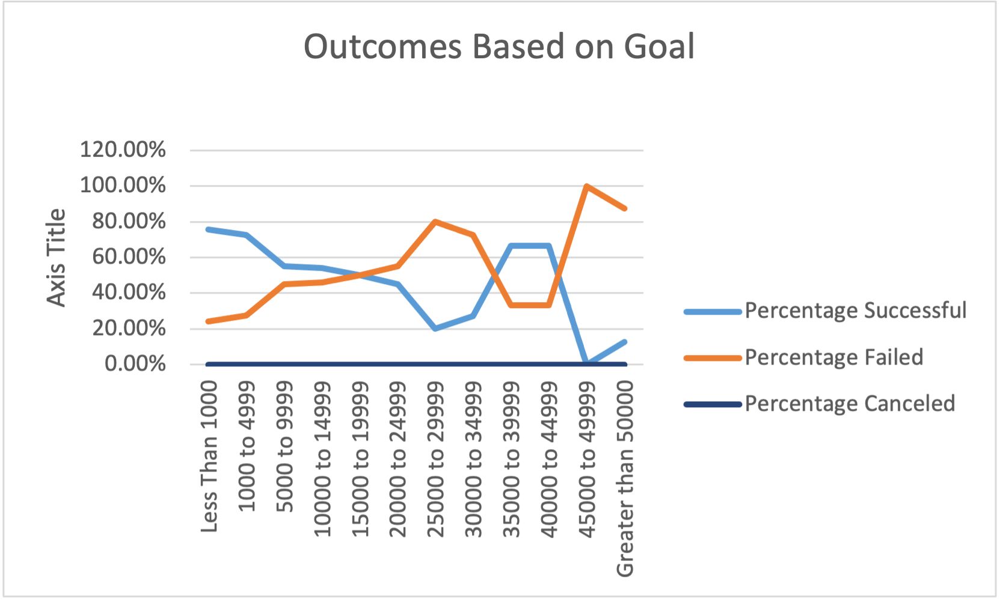
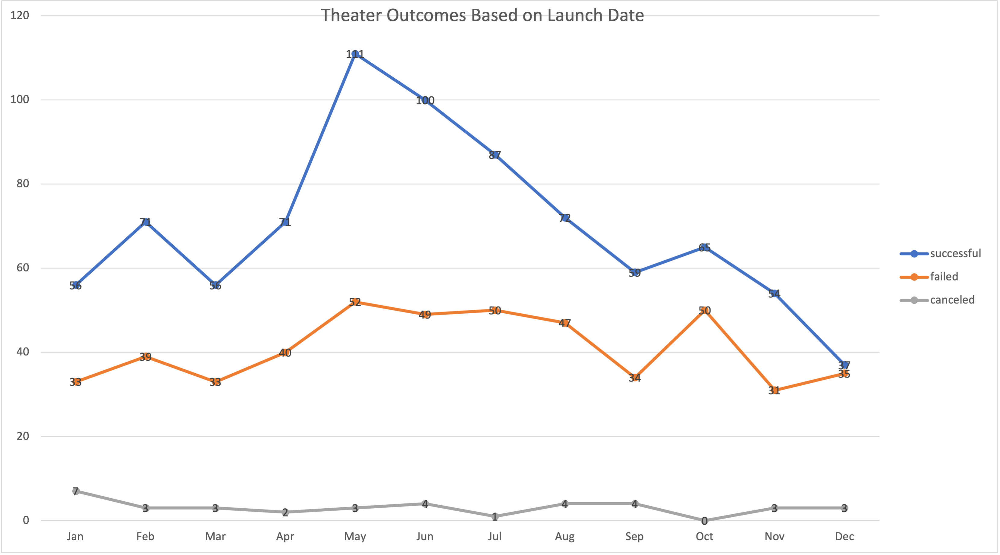

# An Analysis of Kickstarter Campaigns

## Louise's play Fever came close to its fundraising goal in a short amount of time.

### The purpose is to help Louise to know how different theater campaigns fared in relation to launch date and funding goals, by analyzing the outcomes based on launch date and the outcomes based on Goals.
## Analysis and Challenges

### Analysis of Outcomes Based on Launch Date 
By looking at the graph, we can see the month of May and June. They both  have a greater success rate. However, January, March, September, and Novenber have almost the same failed rate around 33%.

### Analysis of Outcomes Based on Goals  
After the goal is set to above $19999, the successful percentage rate keeps decreasing below 50% and the Failed rate increases more than 50%.  However,When the goal range is $35000 to $44999, it comes back with a higher success rate.

### Challenges and Difficulties Encountered

1. The challenge while creating the Theater Outcomes based on  Launch date pivot table, is how to group the row labels and display it by months, because it automatically groups the Date into Years format.

	I figured it out by right clicking on empty space in the year area in Pivot table by selecting Group. In the **Grouping** dialog, select the **Month** from the **By list Box**.

2. The challenge I encountered in Outcomes Based on Goals worksheet, is how to use COUNTIFS with multiple criteria in Excel. Moreover, how to use logical operators such as">=","<=" together" with all those criteria.  I searched some other study resources through internet, and found out that i was missing one more Criteria, the same Column D. It needs to be selected in Kickstarter sheet one more time or type twice in function to perform "5000 to 9999" this price range.
For example,  =COUNTIFS(Kickstarter!D:D,">=5000",Kickstarter!D:D,"<=9999").

	[Click Here](https://www.ablebits.com/office-addins-blog/2014/07/10/excel-countifs-multiple-criteria/comment-page-2/) for the the study resource I found online.

## Results

- What are two conclusions you can draw about the Outcomes based on Launch Date?

	There is higher outcomes in Summer. While Louise launching in May and June, there is the highest success rate. 
On the other hand, December has the lowest outcome.So, it is better to launch projects in warmer season.

- What can you conclude about the Outcomes based on Goals?
	There is lower successful rate followed with higher goals.If Louise set the goal too high, there will be more fail cases. 

- What are some limitations of this dataset?
	
	1. These two graphs which didn't show the relation between goal and the months.
	2. The outcomes based on Goal graph couldn't explain why there is a turning point in $35000 to$4000 goal range.

- What are some other possible tables and/or graphs that we could create?

	The possibility is to create a table relation between goals, month, and outcomes. This is to show if successful rate is related to a lower goal and also for the months.
